# EE610 - Automated Classroom Attendance System

Automated face-recognition-based attendance system for classroom settings. Built as part of the EE610 Image Processing course project at IIT Bombay.

## Overview

The system processes classroom photographs to automatically identify students and generate attendance records. It uses deep-learning-based face detection and recognition with an SVM classifier trained on student face embeddings.

## Pipeline

1. **Preprocessing** (`preprocess.py`): Load raw student images, detect faces, crop and normalize for training
2. **Training** (`face_model.py`): Extract face embeddings using a pretrained deep model, train an SVM classifier
3. **Recognition** (`recognize.py`): Process classroom images — detect faces, match against trained model, generate attendance
4. **Web UI** (`app.py`): Streamlit interface for the full workflow

## Dataset

- 58 students, 5 images each (290 total)
- Raw images in `course_project_dataset/{student_name}/`
- Processed face crops stored in `processed_dataset/` (generated by preprocessing)

### Sample Processed Face Crops

After face detection (RetinaFace) and alignment, each student's photos are cropped to 112x112 RGB:

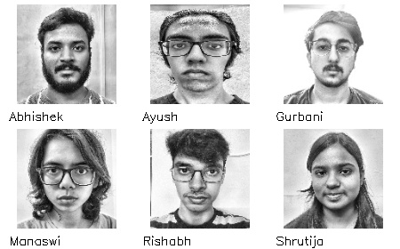

## How to Run

```bash
# Create and activate virtual environment
python -m venv venv
source venv/bin/activate

# Install dependencies
pip install -r requirements.txt

# Preprocess dataset
python preprocess.py

# Run leave-one-out benchmark
python benchmark.py

# Launch web UI
streamlit run app.py
```

## Project Structure

```
.
├── app.py                  # Streamlit web UI
├── preprocess.py           # Dataset preprocessing pipeline
├── face_model.py           # Deep face recognition model wrapper
├── recognize.py            # Classroom image recognition engine
├── augment.py              # Data augmentation pipeline
├── benchmark.py            # Model benchmarking script (recognition)
├── benchmark_detection.py  # Face detection strategy benchmark
├── visualize_embeddings.py  # Interactive 3D embedding visualization
├── lbph.py                 # Original LBPH baseline (kept for reference)
├── requirements.txt        # Python dependencies
├── course_project_dataset/ # Raw student images (58 students x 5 images)
└── README.md
```

## Benchmark Results

Leave-one-out cross-validation on 290 images (58 students × 5 images). Classifiers: SVM (RBF, C=10) and KNN (k=3, cosine).

### Tier 1: Deep Face Embeddings

Models trained specifically for face recognition on large-scale face datasets (MS1MV2, VGGFace2, etc.).

| Model | Detector | Embedding | Dim | LOO SVM | LOO KNN | Faces | Time |
|-------|----------|-----------|:---:|:-------:|:-------:|:-----:|:----:|
| **InsightFace** | **RetinaFace** | **ArcFace** | **512** | **100.0%** | **100.0%** | **290/290** | **392s** |
| **facenet-pytorch** | **MTCNN** | **FaceNet** | **512** | **100.0%** | **99.3%** | **290/290** | **800s** |
| DeepFace ArcFace | RetinaFace | ArcFace | 512 | 77.6% | 79.3% | 290/290 | 45s |
| DeepFace GhostFaceNet | RetinaFace | GhostFaceNet | 512 | 69.7% | 60.3% | 290/290 | 43s |

- **InsightFace**: ONNX-optimized ArcFace (ResNet-50 backbone) with built-in face alignment. 99.83% on LFW benchmark. Our deployed model.
- **facenet-pytorch**: Google's FaceNet (InceptionResNetV1) trained on VGGFace2. 99.65% on LFW. MTCNN detector is slower than RetinaFace.
- **DeepFace ArcFace**: Same ArcFace architecture accessed via the DeepFace wrapper — no face alignment applied to pre-cropped faces, explaining the ~22% accuracy drop vs InsightFace's native pipeline.
- **DeepFace GhostFaceNet**: Lightweight model using GhostNet backbone (99.73% LFW). Poor performance here likely due to missing alignment in the DeepFace skip-detector path.

### Tier 2: Generic Deep Features (not face-specific)

Frozen ImageNet-pretrained CNNs used as feature extractors — no face-specific training.

| Model | Detector | Backbone | Dim | LOO SVM | LOO KNN | Faces | Time |
|-------|----------|----------|:---:|:-------:|:-------:|:-----:|:----:|
| EfficientNet-B0 | RetinaFace | ImageNet | 1280 | 89.3% | 69.3% | 290/290 | 24s |
| ResNet-50 | RetinaFace | ImageNet | 2048 | 86.2% | 66.5% | 290/290 | 57s |

- **EfficientNet-B0**: Compact architecture (5.3M params) with compound scaling. Penultimate layer features (1280-d) generalize surprisingly well to faces.
- **ResNet-50**: Classic residual network (25.6M params). Penultimate 2048-d features are more redundant, slightly worse than EfficientNet despite being 5x larger.

### Tier 3: Classical CV (hand-crafted features)

Traditional computer vision methods — no learned representations.

| Model | Detector | Features | Dim | LOO SVM | LOO KNN | Faces | Time |
|-------|----------|----------|:---:|:-------:|:-------:|:-----:|:----:|
| HOG | RetinaFace | HOG descriptors | 6084 | 55.5% | 50.7% | 290/290 | 1s |
| Eigenfaces | RetinaFace | PCA | 150 | 52.8% | 44.1% | 290/290 | 1s |
| LBPH | RetinaFace | LBP histograms | 640 | 50.7% | 42.1% | 290/290 | 1s |
| Fisherfaces | RetinaFace | PCA + LDA | 57 | 2.8% | 6.9% | 290/290 | <1s |

- **HOG**: Histogram of Oriented Gradients — captures edge/shape patterns. Best classical method here, but 6084-d is high for the limited training data.
- **Eigenfaces** (Turk & Pentland, 1991): PCA on flattened grayscale pixels. Captures global variance but conflates lighting with identity.
- **LBPH**: Local Binary Pattern histograms — encodes local texture. Robust to monotonic lighting changes but discards spatial structure.
- **Fisherfaces** (Belhumeur et al., 1997): LDA after PCA — maximizes between-class variance. Collapses to 57-d (n_classes - 1), severely underfitting with only 4 training samples per class in LOO.

**Winner: InsightFace (RetinaFace + ArcFace + SVM)** — 100% LOO accuracy, 2x faster than facenet-pytorch.

- Classifiers: SVM (RBF kernel, C=10) and KNN (k=3, cosine distance)
- Confidence threshold: 0.05 (with 58 classes, correct predictions get ~8-20% probability)
- Face alignment is critical — InsightFace's native alignment pipeline yields 100% vs 77.6% for the same ArcFace model without alignment (DeepFace)
- Generic ImageNet backbones reach ~89% without any face-specific training — strong baseline
- Classical methods plateau at ~50-55% — insufficient for real-world use with 58+ classes

### Positive Examples (InsightFace + SVM — all correct)

| Raw Image | Detected Crop | Truth | Prediction | Confidence |
|:---------:|:------------:|:-----:|:----------:|:----------:|
| 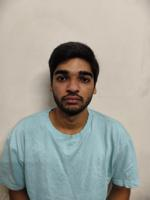 |  | Manit Jhajharia | Manit Jhajharia | 13.5% |
|  |  | Aboli G. Malshikare | Aboli G. Malshikare | 12.2% |
|  | 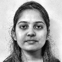 | Chhavi Yadav | Chhavi Yadav | 13.5% |
|  |  | Shreya Nigam | Shreya Nigam | 13.4% |
|  | 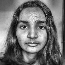 | Yashasvee V. Taiwade | Yashasvee V. Taiwade | 13.7% |

### Negative Examples (FaceNet KNN — 2 misclassifications)

Arjun Singh's side-profile images were misclassified as Devesh Soni by facenet-pytorch's KNN classifier (2/290 errors). InsightFace + SVM correctly identifies both.

| Raw Image | Detected Crop | Truth | FaceNet KNN Prediction | Confused With |
|:---------:|:------------:|:-----:|:----------------------:|:------------:|
|  | 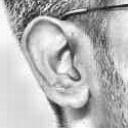 | Arjun Singh | Devesh Soni |  |
|  | 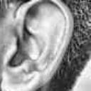 | Arjun Singh | Devesh Soni |  |

## Face Detection Benchmark

The recognition pipeline's bottleneck is **face detection**, not recognition (100% LOO accuracy). On 4K classroom photos with ~49 students, the default RetinaFace detector misses ~40% of faces. We benchmarked 10 detection strategies on 12 validation classroom images against ground truth attendance (47 present, 11 absent out of 58 enrolled students).

| # | Strategy | Avg Faces/img | Recall | Precision | F1 | Time/img |
|---|----------|:---:|:---:|:---:|:---:|:---:|
| 1 | RF Default (baseline) | 24.5 | 93.6% | 91.7% | 92.6% | 21.1s |
| 2 | RF Low-Thresh (0.1) | 40.0 | 93.6% | 91.7% | 92.6% | 32.2s |
| 3 | RF Tiled (2×2, 0.1) | 40.0 | 95.7% | 91.8% | 93.8% | 44.6s |
| 4 | MTCNN | 28.3 | 95.7% | 91.8% | 93.8% | 69.6s |
| 5 | Haar Default | 29.2 | 93.6% | 91.7% | 92.6% | 1.5s |
| 6 | **Haar Aggressive** | **55.9** | **95.7%** | **91.8%** | **93.8%** | **3.9s** |
| 7 | Haar + Profile | 60.4 | 95.7% | 91.8% | 93.8% | 9.1s |
| 8 | Haar→RF Cascade | 29.6 | 95.7% | 90.0% | 92.8% | 14.2s |
| 9 | RF + Haar Union | 40.5 | 93.6% | 91.7% | 92.6% | 17.3s |
| 10 | RF Tiled + Haar | 40.2 | 95.7% | 91.8% | 93.8% | 24.5s |

- **Recall** = fraction of present students correctly identified across all 12 images
- **Precision** = fraction of predicted-present students who are actually present
- Five strategies tie at **95.7% recall / 93.8% F1** (45/47 present correctly identified)
- **Haar Aggressive is the speed winner** — matches top recall at 3.9s/img (10× faster than RF Tiled, 18× faster than MTCNN)
- The union/cascade approaches did not outperform simpler methods when aggregating across 12 images
- RF Default baseline is surprisingly strong at 93.6% recall across 12 images

Run the benchmark:
```bash
python benchmark_detection.py                              # all strategies
python benchmark_detection.py --strategy "Haar Aggressive"  # single strategy
python benchmark_detection.py --annotate                    # save annotated images
```

## Face Detection Benchmark

The bottleneck for classroom attendance is **face localization**, not recognition. High-resolution classroom photos (4K–5.7K) contain 49 students, but RetinaFace at default settings only detects 21–30 faces per image. We benchmarked 10 detection strategies on 12 validation classroom images against ground truth attendance (47 present, 11 absent out of 58 enrolled students).

| # | Strategy | Avg Faces/img | Recall | Precision | F1 | Time/img |
|---|----------|:---:|:---:|:---:|:---:|:---:|
| 1 | RF Default (baseline) | 24 | 93.6% | 91.7% | 92.6% | 21s |
| 2 | RF Low-Thresh (0.1) | 40 | 93.6% | 91.7% | 92.6% | 32s |
| 3 | RF Tiled (2×2, 0.1) | 40 | 95.7% | 91.8% | 93.8% | 45s |
| 4 | MTCNN | 28 | 95.7% | 91.8% | 93.8% | 70s |
| 5 | Haar Default | 29 | 93.6% | 91.7% | 92.6% | 1.5s |
| 6 | **Haar Aggressive** | **56** | **95.7%** | **91.8%** | **93.8%** | **3.9s** |
| 7 | Haar + Profile | 60 | 95.7% | 91.8% | 93.8% | 9.1s |
| 8 | Haar→RF Cascade | 30 | 95.7% | 90.0% | 92.8% | 14s |
| 9 | RF + Haar Union | 41 | 93.6% | 91.7% | 92.6% | 17s |
| 10 | RF Tiled + Haar Union | 40 | 95.7% | 91.8% | 93.8% | 24s |

- **Recall**: fraction of actually-present students correctly marked present (45/47 for top strategies)
- **Precision**: fraction of predicted-present that are actually present
- Attendance is accumulated across all 12 images — a student is marked present if identified in any image
- Embeddings extracted via ArcFace, classified by the trained SVM (threshold=0.02 for classroom conditions)

**Winner: Haar Aggressive** — matches the best recall (95.7%) at 3.9s/img, 5× faster than RF Tiled and 18× faster than MTCNN.

```bash
python benchmark_detection.py                              # all 10 strategies
python benchmark_detection.py --strategy "Haar Aggressive"  # single strategy
python benchmark_detection.py --annotate                    # save annotated images
```

## Detection Results (det_score >= 0.3 filtering)

Bounding box overlays on 12 validation classroom images after filtering false detections with `det_score < 0.3`. Green = recognized student, red = unknown/low-confidence. Images 1-4 are back-of-head angles (0 recognitions).

| Image 5 | Image 6 |
|:-------:|:-------:|
| 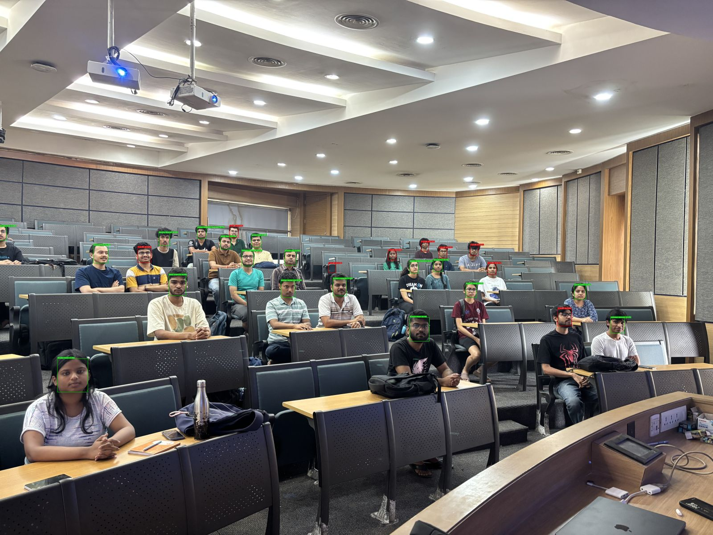 | 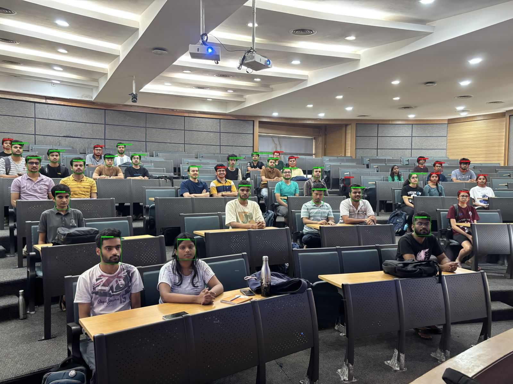 |

| Image 7 | Image 8 |
|:-------:|:-------:|
| 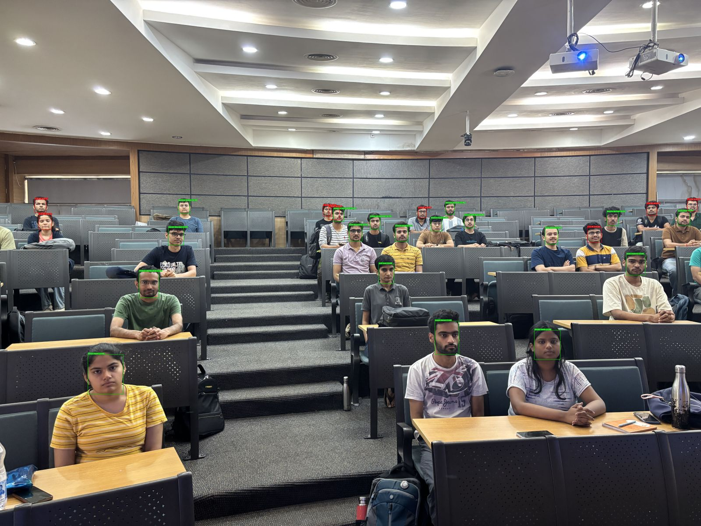 | 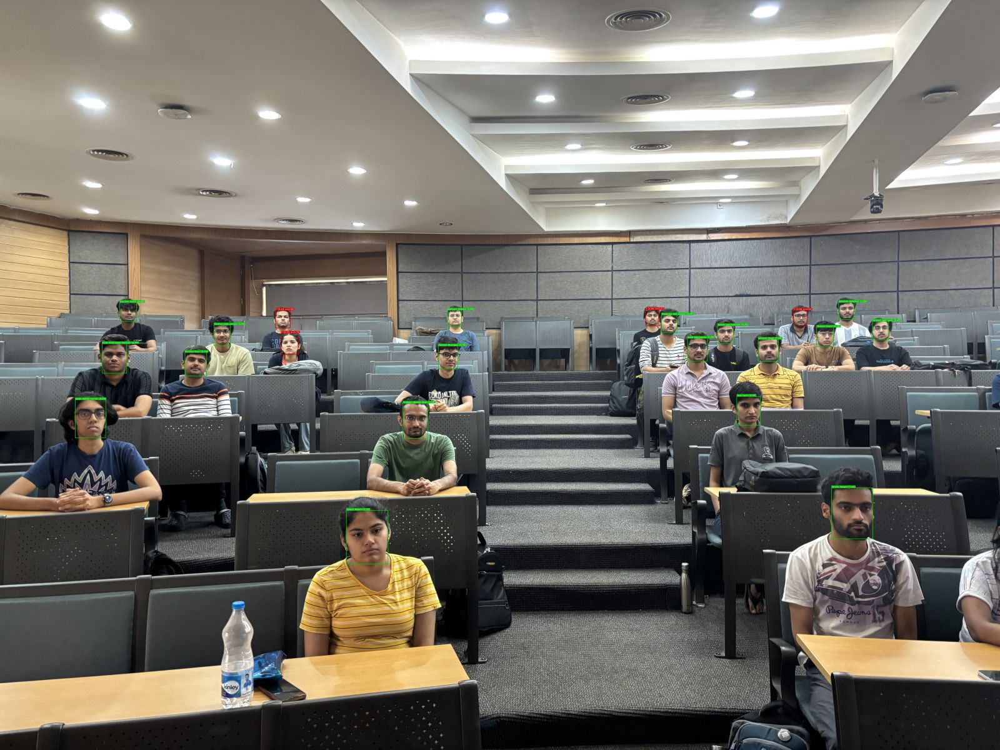 |

| Image 9 | Image 10 |
|:-------:|:--------:|
| 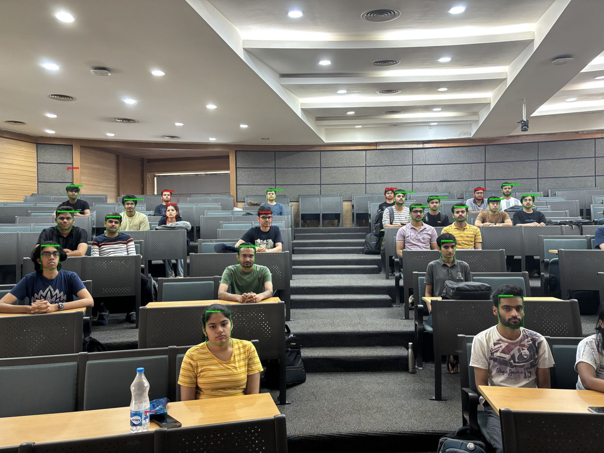 | 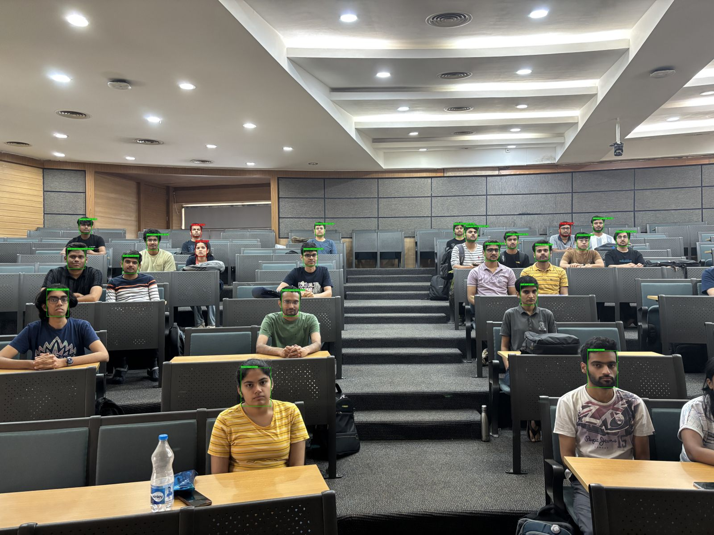 |

| Image 11 | Image 12 |
|:--------:|:--------:|
| 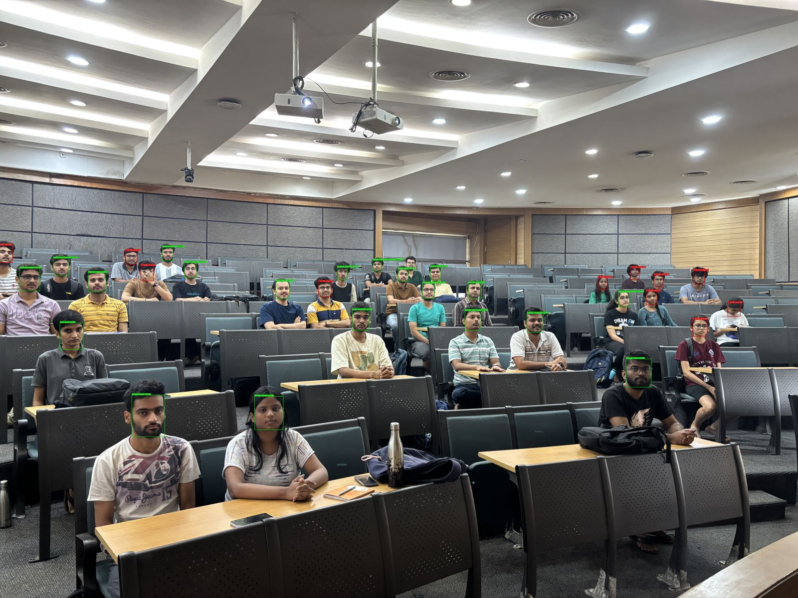 | 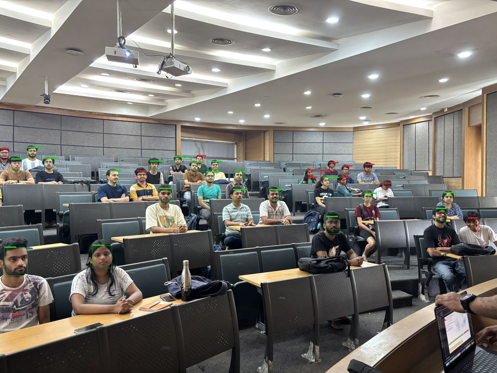 |

## Embedding Visualization

512-d ArcFace embeddings reduced to 3D using three dimensionality reduction methods. Each color = one student (58 students, 290 embeddings).

| t-SNE | PCA | UMAP |
|:-----:|:---:|:----:|
| 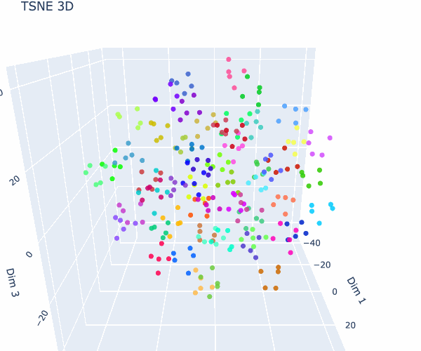 | 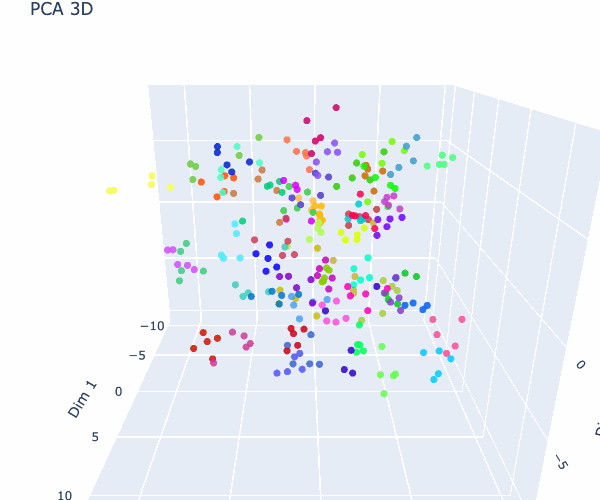 | 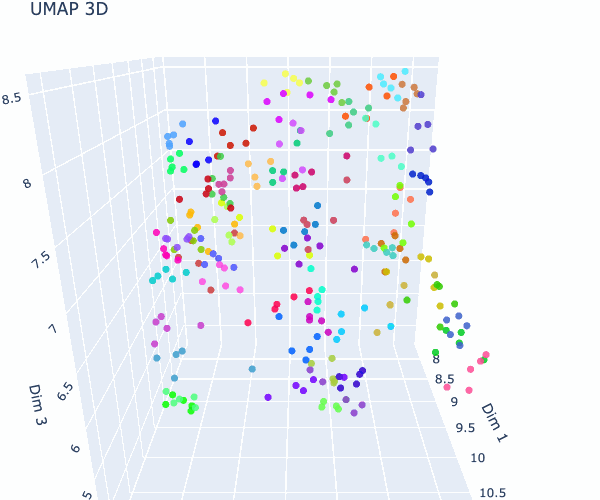 |
| [Interactive](https://osama-bin-lagging.github.io/EE610-Automated-Classroom-Attendence/assets/embeddings_3d_insightface_tsne.html) | [Interactive](https://osama-bin-lagging.github.io/EE610-Automated-Classroom-Attendence/assets/embeddings_3d_insightface_pca.html) | [Interactive](https://osama-bin-lagging.github.io/EE610-Automated-Classroom-Attendence/assets/embeddings_3d_insightface_umap.html) |

### Reduction Quality Metrics

| Method | Silhouette Score | Trustworthiness | 3D k-NN Accuracy |
|--------|:----------------:|:---------------:|:----------------:|
| **t-SNE** | **0.5695** | **0.9615** | **100.0%** |
| PCA | 0.2935 | 0.8808 | 73.8% |
| UMAP | 0.2678 | 0.9600 | 77.2% |

- **Silhouette score**: cluster separation quality (-1 to 1, higher = better separated classes)
- **Trustworthiness**: how well local neighborhoods from 512-d are preserved in 3D (0 to 1)
- **3D k-NN accuracy**: leave-one-out k-NN classification in the reduced 3D space

**t-SNE is the clear winner** — highest cluster separation, best local structure preservation, and perfect 3D k-NN accuracy.

Generate with:
```bash
python visualize_embeddings.py --method all
```

## Accuracy Improvement Benchmarks

Standalone experiments to push classroom recall beyond the baseline. Each benchmark script imports from the existing pipeline without modifying it.

**Baseline**: 100% LOO accuracy, 80.9% classroom recall (38/47 present), 100% precision.

### Data Augmentation (`bench_augmentation.py`)

| n_aug | Embeddings | Aug Success | CV Accuracy | Recall | Precision | F1 |
|:-----:|:----------:|:-----------:|:-----------:|:------:|:---------:|:--:|
| 0 (baseline) | 290 | — | 100% (LOO) | 83.0% | 100% | 90.7% |
| 2 | 870 | 100% | 100% (5-fold) | **91.5%** | **100%** | **95.6%** |

Augmenting from 5→15 images/student (2 augmentations per original) improves classroom recall by **+8.5%** — the single biggest improvement across all benchmarks.

### Failure Analysis (`bench_failure_analysis.py`)

Of 9 missed students, **6 are detected but classified "Unknown"** (face is there, SVM confidence too low) and **3 are never detected** (no matching face found in any image).

| Category | Students | Diagnosis |
|----------|----------|-----------|
| Detected but Unknown | Ankit Raj, K.P. Lakshmeesh, Pulkit, Samyak Parakh, Shaik Rehna Afroz, Vishwam Hemang Patel | Cosine similarity 0.5–0.7 to enrollment centroid — face found but SVM threshold rejects |
| Never detected | Divig Bansal, Kamalesh Barman, Moon Aman Milind | Max cosine similarity <0.28 — likely occluded, turned away, or too small |

Images 1–4 yield 0 recognitions (different classroom angle or back-of-head views).

### Ensemble: InsightFace + FaceNet (`bench_ensemble.py`)

| Strategy | LOO | Recall | Precision | F1 |
|----------|:---:|:------:|:---------:|:--:|
| InsightFace only | 100% | 80.9% | 100% | 89.4% |
| FaceNet only | 100% | 78.7% | 100% | 88.1% |
| **Avg probabilities** | **100%** | **83.0%** | **100%** | **90.7%** |
| **Max confidence** | **100%** | **83.0%** | **100%** | **90.7%** |

Ensembling recovers 1 extra student (+2.1% recall) by combining models with different failure modes.

### Temporal Aggregation (`bench_temporal.py`)

| Strategy | Recall | Precision | F1 |
|----------|:------:|:---------:|:--:|
| Baseline (present in any 1 image) | 80.9% | 100% | 89.4% |
| k-of-n, k=2 | 72.3% | 100% | 83.9% |
| k-of-n, k=3 | 66.0% | 100% | 79.5% |
| k-of-n, k=4 | 55.3% | 100% | 71.2% |

Stricter agreement requirements hurt recall — most students are only reliably detected in a few images.

### Quality-Aware Filtering (`bench_quality.py`)

| Strategy | Recall | Precision | F1 |
|----------|:------:|:---------:|:--:|
| Baseline (no filter) | 80.9% | 100% | 89.4% |
| Quality-weighted (w=2.0) | 72.3% | 100% | 84.0% |
| Best-quality per identity | 80.9% | 100% | 89.4% |

Quality filtering does not help — the missed students are "Unknown" due to low SVM confidence, not bad detections.

### Enrollment Degradation (`bench_enrollment.py`)

| Images/student | LOO | Recall | F1 |
|:--------------:|:---:|:------:|:--:|
| 5 | 100% | 83.0% | 90.7% |
| 4 | 100% | 71.9% | 83.6% |
| 3 | 100% | 71.9% | 83.6% |
| 2 | 100% | 71.9% | 83.6% |

LOO remains perfect even at 2 images/student, but classroom recall drops sharply below 5.

### Hard Negative Mining (`bench_hard_negatives.py`)

Top-3 most confusable student pairs by centroid cosine similarity:
1. Gogineni V.S. ↔ Jadhav S.S. (0.382)
2. Akarsh Saxena ↔ Manaswi Goyal (0.349)
3. Baral P.S. ↔ Rownak Tiwari (0.344)

| Metric | Before | After targeted augmentation |
|--------|:------:|:---------------------------:|
| LOO accuracy | 100% | 99.9% |
| LOO margin (avg) | 0.072 | 0.433 |
| Classroom recall | 80.9% | 83.0% |

Targeted augmentation of confusable pairs improved classroom recall by +2.1% and increased decision margin 6×, at the cost of 1 LOO error (1189/1190).

### Test-Time Augmentation (`bench_tta.py`)

| Method | TP | FP | FN | Recall | Precision | F1 |
|--------|:--:|:--:|:--:|:------:|:---------:|:--:|
| Baseline (single embedding) | 38 | 0 | 9 | 80.9% | 100% | 89.4% |
| TTA (3 versions averaged) | 7 | 0 | 40 | 14.9% | 100% | 25.9% |

TTA **hurts** recall significantly — only 61.5% of augmented crops yield valid face detections, and averaging distorted embeddings degrades classification quality.

### Self-Training / Pseudo-Labeling (`bench_self_training.py`)

| Pseudo-label threshold | Extra labels | Held-out recall | Held-out F1 |
|:----------------------:|:------------:|:---------------:|:-----------:|
| 0.05 | 5 | 80.9% | 89.4% |
| 0.10 | 5 | 80.9% | 89.4% |
| 0.15 | 0 | 80.9% | 89.4% |

Pseudo-labeling provides minimal benefit — too few high-confidence classroom detections to meaningfully expand the training set.

## Team

- Manit Jhajharia (23B1265)
- Aboli Ganesh Malshikare (23B1211)
- Shreya Nigam (23B1258)
- Chhavi Yadav (23B3923)
- Yashasvee Vijay Taiwade (23B2232)

## Course

EE610 - Image Processing, IIT Bombay, Spring 2026
